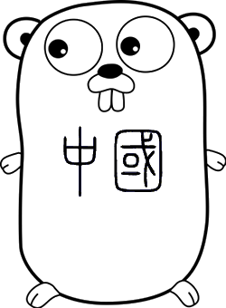

# Go语言中国·中国最早的 Go 语言社区

Go 语言中国社区始于 2010 年，早期同学活跃于 QQ群、Google Code、Google邮件列表和 golang-china.org(已经废弃) 论坛。 早期同学于 2013～2014 年前后均已奔赴各个领域，为 Go 语言在中国的早期传播和使用贡献各自的力量。

现在，诸多第一批的国内 Gopher 已经迈过 35 岁躺平的门槛，终于可以有精力回顾和思考为未来 10 年 Go 在国内的走向。

因此，我们计划重启 Go 语言中国 这个组织， 感谢关注 🙏

